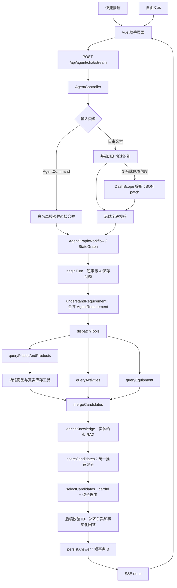

# 约个球 AI 助手当前业务逻辑

> 最后更新：2026-07-25
> 本文只描述当前代码已经实现的行为。后续演进方案见《约个球AI助手Agent实施规划.md》。

## 1. 先理解当前实现是什么

当前 AI 助手采用的是：

```text
Spring AI Alibaba StateGraph 多节点编排
  + 快捷按钮结构化 Command 直通
  + 自由文本“规则优先、模型按需补全”
  + 后端结构化会话记忆
  + 实体约束的博客/评价/装备心得混合 RAG
  + 后端统一、可解释推荐评分
  + DashScope 从真实候选中选择 cardId 并生成逐卡理由
  + 后端校验并生成事实回答
  + Vue 渲染文本和业务卡片
```

当前已经使用 `spring-ai-alibaba-graph-core` 的 `StateGraph`。它属于确定性工作流 Graph：节点和边由后端定义，模型负责候选选择和逐卡推荐理由，不允许自主执行购买、支付或任意数据库工具。它不是完全自治的 ReAct Agent，这种边界可以继续保护价格、库存和时段等业务事实。

当前助手支持四类业务：

1. 根据位置、运动、距离和营业信息推荐真实高德场所。
2. 根据日期、时段、预算查询平台数据库中的真实场馆团购和库存。
3. 查询仍可加入、人数未满且排除自己的约球活动。
4. 根据运动、预算、评分、销量等条件推荐真实装备和装备秒杀。

## 2. 总体架构



主要代码：

| 责任 | 文件 |
| --- | --- |
| HTTP 和 SSE 入口 | `backend/src/main/java/com/hm/badminton/controller/agent/AgentController.java` |
| Graph 定义与执行 | `backend/src/main/java/com/hm/badminton/service/agent/graph/AgentGraphWorkflow.java` |
| Graph 运行上下文/状态 | `backend/src/main/java/com/hm/badminton/service/agent/graph/AgentGraphRunContext.java`、`AgentGraphState.java` |
| 各节点业务实现 | `backend/src/main/java/com/hm/badminton/service/agent/impl/AgentServiceImpl.java` |
| 结构化需求 | `backend/src/main/java/com/hm/badminton/service/agent/impl/AgentRequirementService.java` |
| 快捷命令 DTO | `backend/src/main/java/com/hm/badminton/dto/agent/AgentCommand.java`、`AgentCommandType.java` |
| 模型需求提取 | `backend/src/main/java/com/hm/badminton/service/agent/impl/AgentRequirementModelExtractor.java` |
| 短事务持久化 | `backend/src/main/java/com/hm/badminton/service/agent/impl/AgentPersistenceService.java` |
| 游客匿名身份 | `backend/src/main/java/com/hm/badminton/service/agent/impl/AgentAnonymousSessionResolver.java` |
| 统一评分 | `backend/src/main/java/com/hm/badminton/service/agent/impl/AgentRecommendationScorer.java` |
| RAG 检索 | `backend/src/main/java/com/hm/badminton/service/agent/impl/AgentRagService.java` |
| 并行工具线程池 | `backend/src/main/java/com/hm/badminton/config/AgentAsyncConfig.java` |
| 场所工具 | `backend/src/main/java/com/hm/badminton/service/agent/tools/PlaceAgentTool.java` |
| 场馆商品工具 | `backend/src/main/java/com/hm/badminton/service/agent/tools/VenueProductAgentTool.java` |
| 活动工具 | `backend/src/main/java/com/hm/badminton/service/agent/tools/ActivityAgentTool.java` |
| 装备工具 | `backend/src/main/java/com/hm/badminton/service/agent/tools/EquipmentAgentTool.java` |
| 前端聊天页面 | `frontend/src/App.vue` |
| 前端 SSE 客户端 | `frontend/src/api/client.ts` |
| 生产 SSE 代理 | `deploy/production/nginx/hm-badminton.conf` |

## 3. 前端入口和会话行为

助手有两个入口：

- 底部导航栏“助手”。
- 各主要页面右下角悬浮“AI 助手”。

进入助手页时，`openAssistant()` 会：

1. 切换到助手页面。
2. 查询 `/api/agent/status`，判断 DashScope 是否接入。
3. 登录用户从 MySQL 读取最近一次历史会话。
4. 游客首次进入聊天区为空；提问后凭 `HttpOnly` 匿名 Cookie 从 Redis 恢复最近会话。
5. 登录用户和游客均可打开历史面板、切换会话、确认后删除会话。
6. 聚焦底部输入框。

快捷问题会先打开运动选择器。用户可以选择一个、多个运动或“不限球类”。快捷按钮的显示文字仍会进入聊天记录，但执行依据是结构化 `command`：

```json
{
  "conversationId": 123,
  "message": "今晚附近能打球吗（羽毛球）",
  "sportCode": "badminton",
  "sportCodes": ["badminton"],
  "allSportsRequested": false,
  "city": "西安市",
  "lng": 108.9747,
  "lat": 34.15568,
  "command": {
    "type": "FIND_NEARBY_PLACES",
    "sportCodes": ["badminton"],
    "allSportsRequested": false,
    "timePreset": "TONIGHT",
    "sortPreference": "TIME",
    "availabilityRequired": true
  }
}
```

其中：

- `command` 只由快捷按钮发送；输入框自由文本不发送该字段。
- `type` 只能取后端 `AgentCommandType` 白名单，不能携带 SQL、Mapper 名或任意工具名。
- `TONIGHT` 由后端按北京时间解析；19:00 已过时自动使用下一天 19:00，避免推荐过期场次。
- `sportCode` 用于兼容单运动请求。
- `sportCodes` 是当前正式使用的多运动字段。
- `allSportsRequested=true` 只表示用户明确选择“不限”。
- 如果运动编码和 `allSportsRequested` 错误地同时出现，后端优先采用明确运动编码。

## 4. AI 接口

浏览器统一带 `/api`，Nginx 或 Vite 会去掉 `/api` 后转给 Spring Boot。

| 方法 | 前端路径 | 是否登录 | 用途 |
| --- | --- | --- | --- |
| GET | `/api/agent/status` | 否 | 查询模型是否接入 |
| POST | `/api/agent/chat` | 否 | 非流式聊天，主要作为兼容入口 |
| POST | `/api/agent/chat/stream` | 否 | 当前前端使用的 SSE 聊天入口 |
| GET | `/api/agent/conversations` | 否 | 登录用户查 MySQL；游客查自己的 Redis 会话索引 |
| GET | `/api/agent/conversations/{id}/messages` | 否 | 按登录身份或匿名 Cookie 校验归属后查询消息和卡片 |
| DELETE | `/api/agent/conversations/{id}` | 否 | 登录用户软删除；游客直接删除自己的 Redis 会话 |

三个历史接口均允许游客访问。登录用户以 `userId` 校验 MySQL 会话归属；游客使用不可猜测的 `hm_agent_guest` Cookie 和负数会话 ID 共同定位 Redis 数据。两者删除时都会清除结构化需求缓存。

## 5. 一次聊天请求的完整步骤

核心入口是 `AgentServiceImpl.executeChat()`，它创建本次 `AgentGraphRunContext` 后交给 `AgentGraphWorkflow.execute()`。Graph 当前依次运行：

```text
beginTurn
  -> understandRequirement
  -> dispatchTools
  -> [queryPlacesAndProducts | queryActivities | queryEquipment]
  -> mergeCandidates
  -> enrichKnowledge
  -> scoreCandidates
  -> selectCandidates
  -> persistAnswer
```

### 5.1 开关与限流

1. `hm.agent.enabled=false` 时直接返回 503。
2. 登录用户按 `userId` 限流。
3. 游客按客户端 IP 限流。
4. 默认每分钟最多 10 次请求。

Redis Key：

```text
agent:rate:user:{userId}
agent:rate:ip:{ip}
```

### 5.2 短事务 A：保存本轮问题

`AgentPersistenceService.beginTurn()`：

1. 登录用户检查 `conversationId` 是否属于本人；会话和用户问题写入 MySQL。
2. 游客由后端签发 `HttpOnly` 的 `hm_agent_guest` Cookie；会话元数据、消息和索引写入 Redis，不写 `userId=0` 数据库行。
3. 没有可复用会话时创建新会话；游客使用负数会话 ID，与 MySQL 正数 ID 隔离。
4. 写入结束后立即离开持久化步骤，释放数据库连接。

高德和 DashScope 调用不会占着数据库事务等待。

### 5.3 读取并合并结构化需求

结构化需求优先从 Redis 快速读取。登录会话缓存未命中时回源 MySQL；游客会话回源自己的 Redis 元数据：

```text
Redis: agent:conversation:requirement:{conversationId}
登录用户: MySQL agent_conversation.requirements_json
游客: agent:anonymous:conversation:{anonymousId}:{conversationId}
```

本轮明确条件覆盖旧条件，本轮未提及的条件继续沿用。过期日期会在读取时清理。

需求入口分两条：

```text
快捷按钮
  -> AgentCommand
  -> 校验命令类型、球类、预算、距离、时间、水平和排序
  -> 直接合并 AgentRequirement，不解析按钮文案

自由文本
  -> 基础规则快速识别
  -> 规则缺少意图、长复合条件或模糊指代时调用模型
  -> 模型只返回 AgentRequirementExtraction JSON patch
  -> 后端白名单、范围和日期校验
  -> 模型字段先合并，明确 request/rule 字段随后覆盖
```

因此快捷按钮不会因改了展示文案而切错业务；自由文本也不是每次都多调用一次模型。模型提取失败、JSON 非法或置信度低于 `0.55` 时，系统直接保留规则结果继续执行。

### 5.4 StateGraph 并行查询业务工具

`dispatchTools` 同时连接三个查询节点，Spring AI Alibaba Graph 将它们转换成并行节点，并使用项目的有界 `agentToolExecutor` 执行：

```text
结构化需求
  ├─ 场所查询 -> 场馆团购/库存查询
  ├─ 活动查询
  └─ 装备/装备秒杀查询
```

场馆团购依赖场所搜索结果，所以它和场所查询封装在同一个分支中，严格执行“高德场所 -> 对应场馆团购”。每个工具调用仍受 `tool-timeout-seconds` 限制，超时或异常时该分支返回空结果，不阻塞其他分支。

### 5.5 实体约束 RAG

`enrichKnowledge` 只处理已经通过业务工具验证的卡片：

1. 场馆评价按 `city + sportCode + placeRank` 定位本地场所记录，只绑定当前真实高德场所卡。
2. 装备博客只绑定 `related_type=EQUIPMENT` 且 `related_id` 相同的装备卡。
3. 场馆商品博客只绑定相同商品，并可同时为同一真实场所提供软知识。
4. 向量可由 DashScope Embedding 生成并按内容哈希缓存到 Redis；不可用时自动使用中文词法相似度。
5. 证据保留来源类型、来源 ID、标题、摘录和相关度，不允许覆盖价格、库存、时段等硬事实。

### 5.6 统一推荐评分

`scoreCandidates` 对所有卡片执行同一个评分入口，并按卡片类型使用不同业务因子。公共因子包括运动、当前可用、预算、水平、用户偏好、RAG 口碑和排序偏好；类型因子分别关注场所距离、团购时段、活动名额、装备评分与库存。结果写入：

```text
recommendScore   0-100 最终分
scoreBreakdown   每个因子的得分
rankingVersion   当前为 unified-v1
recommendReasons 确定性兜底理由
```

### 5.7 模型选择候选

后端把候选裁剪成人类可读字段，并发送给 DashScope。模型只能返回：

```json
{
  "selectedCardIds": ["place:B0...", "venue:2:5"],
  "recommendationReasons": {
    "place:B0...": "距离较近，且营业时间覆盖晚间需求",
    "venue:2:5": "时段完全匹配，价格也在预算内"
  },
  "explanation": "本次主要比较时间、距离和预算"
}
```

模型不负责创造最终价格、库存、距离或时段。`recommendationReasons` 必须按已选 `cardId` 分别返回；后端只接受本轮已验证卡片对应的短理由，重复理由会被丢弃。`explanation` 仍只写调试日志，不直接展示。

### 5.8 后端校验和补齐

模型结果会经过：

1. 删除不属于本轮候选集合的 `cardId`。
2. JSON 错误、结果为空或模型异常时，按 `recommendScore` 确定性排序兜底。
3. 场所类问题有多个真实候选时，至少保留 2 个场所。
4. 优先补充带真实可售团购的场所。
5. 模型只选团购时，补上对应真实场所。
6. 模型只选场所时，补上同一场所最合适的真实团购。
7. AI 逐卡理由只能绑定到通过校验的 `cardId`。
8. 最终场所和团购组合最多保留 6 张底层卡片。

### 5.9 后端生成事实回答

最终回答由 `groundedAnswer()` 根据已验证卡片生成，而不是直接展示模型自由文本。

回答中的名称、价格、日期和时段全部来自真实卡片。DashScope 正常时，逐项推荐理由由模型根据对应卡片事实生成；模型不可用、格式错误或理由重复时，回退到工具层基于时段、价格、退款规则和场景生成的事实理由。推荐理由只显示在上方回答，不在下方场所卡片中重复展示。

### 5.10 短事务 B：保存结果

登录用户的 `AgentPersistenceService.completeTurn()` 在一个短事务内：

1. 保存助手回答。
2. 保存最终业务卡片 JSON。
3. 更新会话的结构化需求 JSON 和时间。

游客的答案、卡片和结构化需求直接写入匿名 Redis 会话。随后结构化需求还会写入快速读取缓存：登录用户默认 60 分钟，游客与匿名历史 TTL 对齐。

## 6. 结构化会话记忆

`AgentRequirement` 当前字段：

| 字段 | 含义 | 示例 |
| --- | --- | --- |
| `sportCodes` | 一个或多个运动编码 | `badminton`、`table_tennis` |
| `city` | 本轮目标城市 | `西安市` |
| `targetDate` | 目标日期 | `2026-07-18` |
| `startTime` | 开始时间 | `19:00` |
| `endTime` | 结束时间 | `20:00` |
| `durationMinutes` | 期望时长 | `60` |
| `minBudget/maxBudget` | 最低与最高预算 | `100-300` |
| `maxDistanceMeters` | 最远距离 | `3000` |
| `level` | 水平要求 | `不限`、`初级`、`中级`、`高级` |
| `equipmentKeyword` | 归一化后的装备类别 | `鞋`、`球拍`、`手胶` |
| `preferenceTags/avoidTags` | 偏好和排除项 | `停车`、`灯光好`、`不拥挤` |
| `sortPreference` | 排序目标 | `DISTANCE`、`PRICE`、`VALUE` |
| `availabilityRequired` | 是否要求当前可用 | `true` |
| `refundableRequired` | 是否要求支持退款 | `true` |
| `fieldSources` | 字段来源 | `command/request/rule/model/profile/follow-up` |
| `intents` | 当前业务意图 | `PLACE`、`ACTIVITY`、`EQUIPMENT` |
| `lastSelectedCardIds` | 上轮最终卡片 | 用于记录上一轮选择 |

当前解析规则包括：

- 运动：羽毛球、乒乓球、足球、篮球、网球、排球。
- 日期：今天、今晚、明天、后天、完整日期、月日。
- 时间：`19:00-21:00`、`19点`、晚上、上午、下午、下班后。
- 预算：`50 元以内`、`预算 300`、`至少 200 元`、`100-300 元`。
- 距离：`3km`、`1500米`。
- 偏好：停车、淋浴、地铁、灯光、地胶、环境、新手友好，以及否定条件。
- 排序：最近、最低价、最高评分、时间优先和性价比。
- 水平：不限、新手、初级、中级、高级、进阶。
- 装备类别：把“鞋子/球鞋/训练鞋”归一为“鞋”，并识别球拍、手胶、护具、球包、球袜等类别。
- 意图：根据场所、团购、活动、搭子、装备等关键词判断。
- 追问：用户要求“按预算筛装备”但没有给金额时，先询问预算。
- 自动预算回退：用户已给出上限但无严格匹配时，保持运动和装备类别不变，从真实库存中选择价格最接近的一件，并直接告知需要增加的金额；无需用户再点一次更高预算。
- 自动回退后仍无同类商品时才建议更换品类，装备请求不会错误切换到场馆团购。

模型提取不是业务工具调用。它只能补充 `AgentRequirementExtraction` 中定义的字段，且必须通过以下校验：

- 意图仅允许 `PLACE/ACTIVITY/EQUIPMENT`。
- 球类、水平和排序值必须属于后端白名单。
- 预算限制在 `0-100000`，距离限制在 `100-50000` 米。
- 过去日期、非法时间、过长标签和未知枚举会被丢弃。
- 同一个字段同时被模型和明确规则识别时，`request/rule` 优先。

位置优先级：

```text
本次请求经纬度
  > 登录用户最近一次定位
  > 默认西安坐标
```

## 7. 四类业务工具

### 7.1 场所工具

数据来源：高德附近 POI。

当前行为：

- 默认查询半径 8km，用户提出距离时先使用该距离，最大限制 50km。
- 结果少于 2 个时，后端在同一次请求内按 `8km -> 15km -> 30km -> 50km` 有界扩圈；获得足够结果或达到 50km 即停止，并在回答中明确实际扩大到的范围。
- 高德一次返回最多 6 个场所。
- 当前进入模型候选的是前 2 个场所。
- 推荐依据包括距离、设施标签、营业时间和高德返回顺序。

场所分数大致为：

```text
基础分 55
+ 距离最多 25
+ 设施最多 10
+ 营业到晚上 5
+ 搜索顺序最多 10
```

### 7.2 场馆团购工具

数据来源：平台 MySQL 的 `venue` 和 `venue_inventory`，不是高德团购。

查询条件包括：

- 运动类型。
- 当前高德结果对应的 `placeRank`。
- 日期、开始时间和结束时间。
- 最高预算。
- `available_stock > 0` 且状态可售。

匹配顺序：

1. 日期、开始时间和结束时间完全匹配，标记 `EXACT`。
2. 完全匹配不存在时，仅回退同一天真实存在的 `COURT_SLOT` 单场一小时，标记 `ONE_HOUR_FALLBACK`。
3. 用户没有提出日期和时间时，查询最近未来可售时段，标记 `UPCOMING`。
4. 仍没有库存时不生成团购卡，不拿上午券冒充晚间券。

团购分数：

```text
完全匹配 95
单场一小时回退 78
最近可售 70
真实折扣额外 +4
```

演示环境会在启动和每天 `00:05` 维护排序绑定演示库存：

- 过期日期滚动到未来。
- 明天才开始的窗口对齐到今天。
- 演示 `COURT_SLOT` 容量不足 8 时扩到 8。
- 只处理没有真实 `venue_id` 的演示库存，不修改真实场馆库存。
- 日期、时段和库存校验仍然保留。

### 7.3 约球活动工具

数据来源：平台活动表。

当前规则：

- 先查询同城市、同运动的“他人发起”活动，再由 `ActivityAgentTool` 做语义筛选，避免 SQL 字符串等值比较误判。
- 排除当前登录用户自己创建的活动。
- 排除人数已满的活动。
- “他人发起”和 AI 推荐只返回开始时间晚于当前时间的活动，场次开始后立即停止推荐；“自己发起/自己加入”仍可查看尚未结束的进行中活动。
- 用户指定日期时只保留当天活动；指定时段时按区间重叠判断，例如活动 `19:00-21:00` 可以匹配需求 `19:00-20:00`。
- 水平按最低门槛兼容：中级用户可以参加“初级以上”，高级用户可以参加初级或中级门槛；“不限”表示取消水平限制，不会查询字面值为“不限”的活动。
- 每个运动最多加入 2 个候选。
- 推荐依据包括水平匹配、剩余人数、明确时间和费用方式。

无结果时，后端返回的是可直接执行的快捷问题：

- 19:00 前：`查看今天19:00可加入的局`、`不限水平查看今天可加入的局`
- 19:00 后：`查看明天19:00可加入的局`、`不限水平查看明天可加入的局`

这两个问题会重新解析日期、时间和水平，不再使用“调整约球时间”这种没有新条件的模糊指令，因此不会错误沿用上一轮筛选。

演示活动的时间维护规则：

- `data.sql` 中 48 场 `DEMO_*` 活动覆盖 4 城市 × 6 球类 × 今天/明天，时段统一为 `19:00-21:00`。
- `_D0` 表示今天，`_D1` 表示明天。应用启动时和每天北京时间 `00:05`，`ActivityMaintenanceTask` 会把它们重新对齐到滚动两日窗口，重复执行是幂等的。
- 今天 19:00 开始后，D0 场次不再出现在可加入推荐中，系统自然回退到明天的 D1 场次。
- 维护 SQL 只识别 `place_id` 以 `DEMO_` 开头的演示记录；用户真实发起的活动绝不改期，过期后只会转为“已结束”。
- AI 活动工具与普通约球页读取同一张活动表，因此两处看到的演示日期一致。

活动分数大致为：

```text
基础分 50
+ 剩余人数最多 15
+ 水平匹配最多 20
+ 时间明确 10
+ 费用明确 5
```

### 7.4 装备工具

数据来源：平台装备和装备秒杀表。

普通装备：

- 按运动、关键词和预算筛选。
- 每个运动最多加入 2 个候选。
- 推荐依据包括预算、评分、销量、库存、品牌和分类。
- 若严格预算没有结果，`searchClosestEquipmentAboveBudget` 会查询最多 50 条同类真实商品，过滤无库存商品，按价格升序选择最接近预算的候选。
- 多球类同时查询时，编排层再比较 `budgetIncrease`，最终只保留全局需要加价最少的一件。
- 回退卡片携带 `budgetExpanded/originalBudget/budgetIncrease`。本地回答和模型提示都必须明确说明预算变化，禁止描述为“符合原预算”。
- 若更高价格也没有同类可购买商品，才返回更换品类提示，不再生成另一轮 500/1000 元预算按钮。

只有问题包含“秒杀、特价、抢购、便宜”等词时，才额外查询装备秒杀，每个运动最多加入 2 个。

装备分数大致为：

```text
基础分 45
+ 预算匹配最多 25
+ 评分贡献
+ 销量最多 10
+ 当前有库存 10
```

## 8. 候选数量规则

当前每个运动的候选上限：

| 类型 | 工具原始查询 | 进入总候选 |
| --- | ---: | ---: |
| 场所 | 6 | 2 |
| 场馆团购 | 每个场所最多 6 | 每个场所取 1 |
| 约球活动 | 8 | 2 |
| 普通装备 | 8 | 2 |
| 装备秒杀 | 6 | 2 |

所有运动合并后最多保留 18 张候选卡片，模型最多选择 4 张。场所补齐和场所/团购配对后最多返回 6 张底层卡片。

场所类回答不会再完全服从模型的“只选一处”：有至少两处真实场所时，后端保证最终展示两处，且有真实团购的场所优先。

## 9. 防止模型编造

当前保护有六层：

1. 价格、库存、日期、时段全部先由业务工具查询。
2. 模型只看到裁剪后的事实和不透明 `cardId`。
3. 模型返回的 ID 必须属于本轮候选。
4. 后端重新补齐场所和团购关系。
5. AI 推荐理由只能绑定到已验证卡片 ID，重复和超长理由会被拒绝。
6. 名称、价格、库存、距离和时段仍由后端根据卡片生成。

模型不会收到前端动作 payload，也不会直接执行订单、支付、加购或加入活动。

模型选择失败时，系统按照 `recommendScore` 排序，所以 DashScope 暂时不可用时仍能返回真实业务结果，只是推荐解释更模板化。

## 10. AgentCard 和前端渲染

统一卡片结构：

```text
cardId       模型使用的不透明候选 ID
type         place / venue_product / activity / equipment / seckill
title        名称
subtitle     简介
coverUrl     图片
price        已格式化价格
tags         页面标签
action       前端跳转或操作描述
meta         后端排序、匹配和动作所需结构化字段
```

场所和团购的配对方式：

1. 后端把真实高德 `placeId` 附加到团购卡片。
2. 场所和团购都携带相同的 `sportCode + placeRank`。
3. 前端 `agentPlaceBundles()` 用该组合把两张底层卡合并成一张横滑场所卡。
4. 上半部分展示场所，下半部分展示同场真实团购。
5. 没有严格匹配的真实团购时显示“暂无在线团购”，不会伪造一个商品。

AI 回答渲染先执行 HTML 转义，再只允许有限的加粗和有序/无序列表格式，防止回答内容直接注入任意 HTML。

## 11. 用户动作闭环

| 卡片 | 点击后的行为 |
| --- | --- |
| 场所 | 打开场所详情；返回时回到 AI 助手 |
| 场馆团购 | 打开对应团购详情；返回时回到 AI 助手 |
| 约球活动 | 登录后调用加入活动接口 |
| 装备 | 打开真实装备详情 |
| 装备秒杀 | 打开装备页面，由用户继续确认抢购 |

场馆团购卡还提供“约球”：

1. 前端再次查询该商品当前可购买库存。
2. 弹出确认面板，选择库存时段、计划人数和水平要求。
3. 默认计划人数 4，允许 2 至 20 人；水平默认“不限”。
4. 用户确认后调用 `/api/social/activities/book-and-create`。
5. `VenueActivityBookingService` 在一个事务中扣库存、创建并支付场馆订单、创建约球活动和发起人成员记录。
6. 任一步失败，订单、库存和活动一起回滚。

AI 本身不会自动购买，这个组合动作必须由用户点击并确认。

## 12. SSE 流程

当前 SSE 事件：

| 事件 | 内容 | 前端行为 |
| --- | --- | --- |
| `stage` | 当前阶段和提示 | 显示“正在理解/查询/生成建议” |
| `conversation` | `conversationId` | 尽早绑定本轮会话 |
| `cards` | 全部候选卡片 | 服务端已发送，前端当前暂未提前渲染 |
| `done` | 最终回答、卡片、快捷问题 | 结束思考态并渲染结果 |
| `error` | 错误码和消息 | 结束思考态并提示错误 |

前端使用 `fetch + ReadableStream`，因为原生 `EventSource` 只支持 GET，无法提交聊天 JSON。

生产 Nginx 对 SSE 单独关闭缓冲：

```nginx
location = /api/agent/chat/stream {
    proxy_buffering off;
    proxy_cache off;
    proxy_read_timeout 120s;
    add_header X-Accel-Buffering no always;
}
```

当前流式的是“阶段进度”，最终回答仍一次性返回，不是逐字 Token 流。

## 13. MySQL、Redis 和事务

MySQL：

```text
agent_conversation
  id / user_id / title / requirements_json / status / created_at / updated_at

agent_message
  id / conversation_id / user_id / role / content / cards_json
  / tool_name / tool_result_json / created_at
```

Redis：

```text
agent:conversation:requirement:{conversationId}  结构化短期需求
agent:anonymous:conversations:{anonymousId}      游客历史索引
agent:anonymous:conversation:{anonymousId}:{id}  游客会话元数据和结构化需求
agent:anonymous:messages:{anonymousId}:{id}      游客消息与卡片
agent:rag:embedding:{contentHash}                 RAG 向量缓存
agent:rate:user:{userId}                         登录用户限流
agent:rate:ip:{ip}                               游客限流
```

游客会话默认保留 7 天，最多 30 个会话，每个会话最多 100 条消息；每次访问会续期。浏览器清除 Cookie 或 TTL 到期后，匿名历史无法恢复。

事务边界：

```text
登录事务 A：创建/复用会话 + 保存用户问题
事务外：高德 + MySQL 查询工具 + RAG/Embedding + DashScope
登录事务 B：保存助手消息 + 卡片 + requirements_json
游客持久化：Redis 短操作，不开启跨外部调用的数据库事务
```

这样不会因为模型响应慢而长时间占用数据库连接。

## 14. 日志和性能定位

每次请求生成 8 位 `requestId`，主要日志格式：

```text
agent.step requestId=... step=places:badminton elapsedMs=... count=...
agent.step requestId=... step=venue-products:badminton elapsedMs=... count=...
agent.step requestId=... step=rag elapsedMs=...
agent.step requestId=... step=model elapsedMs=...
agent.total requestId=... conversationId=... elapsedMs=... cards=...
```

通过同一个 `requestId` 可以判断时间花在：

- 保存问题。
- 读取记忆。
- 高德场所查询。
- 场馆库存查询。
- 活动或装备查询。
- RAG 评价、博客和装备心得检索。
- DashScope 模型。
- 保存回答。

工具默认 5 秒超时。单个工具失败会返回空候选，不阻断其他工具；模型失败则走本地确定性排序。

## 15. 关键配置

```yaml
spring:
  ai:
    dashscope:
      enabled: ${AI_DASHSCOPE_ENABLED:false}
      api-key: ${AI_DASHSCOPE_API_KEY:}
      chat:
        options:
          model: ${AI_MODEL:qwen-plus}
          temperature: 0.3
          max-tokens: 1200

hm:
  agent:
    enabled: true
    memory-ttl-minutes: 60
    rate-limit-per-minute: 10
    tool-timeout-seconds: 5
    tool-threads: 6
    anonymous-history-ttl-days: 7
    anonymous-max-conversations: 30
    anonymous-max-messages-per-conversation: 100
    rag-enabled: true
    rag-embedding-enabled: ${AI_RAG_EMBEDDING_ENABLED:true}
    rag-candidate-limit: 48
    rag-top-k: 3
    rag-embedding-cache-days: 7
```

生产环境变量：

```text
AI_DASHSCOPE_ENABLED=true
AI_DASHSCOPE_API_KEY=<DashScope API Key>
AI_MODEL=qwen-plus
```

API Key 只放在服务器 `/etc/hm-badminton/app.env`，不能写入 Git。

## 16. 示例：今晚附近打羽毛球

用户输入：

```text
今晚附近能打球吗（羽毛球）
```

当前执行过程：

1. 快捷按钮发送 `FIND_NEARBY_PLACES` Command，不重新猜测显示文案。
2. 后端校验并写入 `sportCodes=[badminton]`、意图 `PLACE`。
3. `TONIGHT` 转成下一个可用的 `19:00-20:00`。
4. 按用户经纬度查询附近高德羽毛球场所。
5. 对前两处场所查询 `venue_inventory`。
6. 只接受今天 `19:00-20:00` 的真实可售库存；不存在时查同日真实单场一小时。
7. DashScope 从候选中选择。
8. 后端保证至少保留两处真实场所，并补齐对应团购。
9. 后端生成包含价格、时段和推荐理由的回答。
10. 前端展示两张横滑场所卡，每张卡包含“看场所”和真实团购操作。

## 17. 当前仍存在的不足

### 17.1 模型需求提取仍是补全器

当前已完成“快捷 Command + 规则优先 + 复杂文本模型 JSON 补全”。它能改善长复合条件和模糊指代，但农历、周期性计划、“离公司近”等缺少坐标的表达仍可能需要澄清。模型提取还会增加一次远程调用，因此只在规则低置信度时启用，不能替代确定性规则。

### 17.2 场所候选目前只取前两处

高德单次最多返回 6 条，数量不足时已经自动扩圈，但当前仍只为前两处进入最终工具链并查询团购。这样请求数量小、响应快，但多样性不足。后续可先批量查询可售情况，再选 3 至 4 个差异明显的场所。

### 17.3 Graph 仍是确定性工作流

当前已经完成 StateGraph 多节点编排和并行分支，需求入口采用 Command/规则/模型混合解析，但节点路由仍由后端业务规则控制。它没有让模型动态规划写操作，也没有启用 Graph Checkpointer；跨轮业务记忆继续由现有 MySQL + Redis 管理。这是当前安全边界，不应描述成完全自治 Agent。

### 17.4 RAG 仍是轻量实现

当前已接入实体约束的混合 RAG，但仍按完整博客/评价检索，尚未做长文本分段、增量索引、召回率评估和用户反馈学习。数据量明显增大后应引入专用向量存储，而不是无限扩张 Redis 向量缓存。

### 17.5 游客历史不会自动归并账号

游客已能查看、切换和删除自己的 Redis 历史，但清除 Cookie、更换浏览器或 TTL 到期会丢失；游客随后登录时也不会自动合并到账号，避免未经确认污染用户正式历史。

### 17.6 SSE 还不是完整流式回答

页面能及时看到查询阶段，但正文需要等待模型选卡完成。可以在保持结构化选卡的前提下，再增加一个经过事实约束的文本流式渲染阶段。

### 17.7 评分权重仍是代码配置

统一评分已经产生 `scoreBreakdown`，但权重目前固定在 Java 中。下一步应把权重外置，并基于点击、加购、购买、加入活动等反馈做离线评估，避免凭主观长期调参。

### 17.8 部分配置和字段尚未真正使用

`agent_message.tool_name/tool_result_json` 尚未保存工具轨迹。若后续需要逐节点审计，可在 Graph 节点完成时记录摘要；当前不要保存完整高德响应或模型提示词，避免无意义的数据膨胀。

## 18. 推荐阅读代码顺序

第一次阅读时按下面顺序：

1. `frontend/src/App.vue` 的 `sendAgentMessage()`，先看前端发送了什么。
2. `frontend/src/api/client.ts` 的 `streamApi()`，理解 SSE 如何解析。
3. `AgentController.chatStream()`，找到后端入口。
4. `AgentGraphWorkflow`，先看节点、并行边和汇合点。
5. `AgentServiceImpl.beginTurn()` 到 `persistAnswer()`，理解每个节点的业务实现。
6. `AgentCommand`、`AgentCommandType`，理解快捷操作的白名单协议。
7. `AgentRequirementService.merge()`，对比 Command 直通和自由文本混合解析。
8. `AgentRequirementModelExtractor`，理解低置信度 JSON 补全及失败降级。
9. 四个 `service/agent/tools` 工具类，理解候选从哪里来。
10. `AgentRagService`，理解评价、博客、装备心得如何按实体绑定。
11. `AgentRecommendationScorer`，理解统一评分与分项得分。
12. `VenueItemService.agentCandidates()`，理解真实时段匹配。
13. `AgentServiceImpl.callModelOrFallback()`，理解模型选卡和逐卡理由。
14. `AgentServiceImpl.finalizeSelection()`，理解后端怎样补齐两处场所和团购。
15. `AgentPersistenceService` 与 `AgentAnonymousSessionResolver`，理解登录/游客两种存储。
16. 回到 `App.vue` 的 `agentPlaceBundles()` 和卡片模板，理解最终页面。

## 19. 最终版维护约定

1. 价格、库存、时段、活动人数和订单状态只能来自实时业务工具，不能写入 Prompt 作为固定事实。
2. 模型只能返回候选 `cardId` 与解释，后端必须验证 ID 并重新用真实卡片渲染。
3. 新增快捷按钮时同时新增结构化 `AgentCommand`，不要只添加一句自然语言让系统重新猜意图。
4. 新增记忆字段时要同步修改解析、合并、持久化、清空条件和测试。
5. 新增 Graph 节点时要声明输入、输出、超时、降级和可观测字段，禁止在数据库事务中调用模型或高德。
6. 发布前执行后端测试、前端构建和至少一轮真实 DashScope 对话回归。

当前 AI 已适合演示真实业务推荐闭环，但仍不具备完全自治、商业 SLA 或无限知识准确性。统一验收口径见 [最终版评审与验收清单](最终版评审与验收清单.md)。
